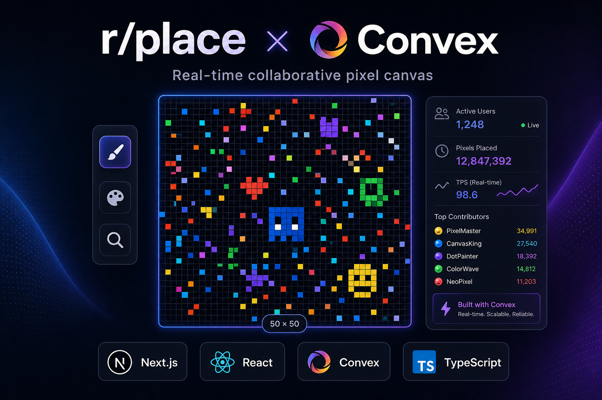
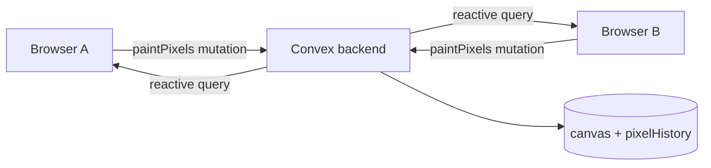

# r/place — Convex Live Canvas

**Live demo:** [rplace-convex-lime.vercel.app](https://rplace-convex-lime.vercel.app/) · **Source:** [github.com/odilson-dev/rplace-convex](https://github.com/odilson-dev/rplace-convex)

A real-time, collaborative pixel canvas inspired by [Reddit’s r/place](https://www.reddit.com/r/place/). Multiple people can paint on the same 50×50 grid at once; every stroke is stored in the backend and pushed live to all connected browsers.

The app is a **Next.js** frontend with a **[Convex](https://convex.dev)** backend. Convex is not an optional add-on here—it is the system that makes shared state, live updates, and durable writes possible without you running a separate API server, WebSocket layer, or database sync code.

---

## Why Convex matters in this project

Collaborative canvases need three things at once:

1. **Shared state** — one source of truth for the pixel grid.
2. **Live updates** — when someone else paints, you see it immediately.
3. **Safe writes** — strokes must be applied reliably and consistently.

Convex provides all of this in one platform:

| Concern            | How this repo uses Convex                                                                                          |
| ------------------ | ------------------------------------------------------------------------------------------------------------------ |
| **Database**       | The `canvas` table holds the full pixel array; `pixelHistory` records who placed which pixel and when.             |
| **Backend logic**  | Queries and mutations in [`convex/canvas.ts`](convex/canvas.ts) validate input, update pixels, and append history. |
| **Real-time sync** | The React client subscribes with `useQuery(api.canvas.getCanvas)`—no manual polling or Socket.io setup.            |
| **Type safety**    | Generated types in `convex/_generated/` keep the frontend and backend aligned.                                     |

### Data flow (simplified)



On the client ([`app/_canvas/canvas.tsx`](app/_canvas/canvas.tsx)):

- **`useQuery(api.canvas.getCanvas)`** — subscribes to the canvas; when any user’s mutation updates the document, all subscribers re-render with the new pixels.
- **`useMutation(api.canvas.paintPixels)`** — sends batched pixel changes (optimistic UI first, then sync).
- **`useMutation(api.canvas.ensureCanvas)`** — creates the default black canvas on first visit.
- **`useMutation(api.canvas.clearCanvas)`** — resets the grid.

Session identity is a stable anonymous ID in `localStorage` ([`app/_canvas/use-session-user-id.ts`](app/_canvas/use-session-user-id.ts)), passed to mutations as `userId` for history tracking. You can later plug in Convex Auth (see [Convex auth docs](https://docs.convex.dev/auth)) without changing the overall pattern.

---

## Features

- **50×50 pixel grid** (2,500 pixels) with preset palette, pen, eraser, eyedropper, and pan tool
- **Zoom and pan** (scroll wheel, space + drag, hand tool)
- **Optimistic painting** with batched writes to Convex
- **Live collaboration** — see other users’ changes as they land
- **Paint history sidebar**, coverage stats, light/dark theme
- **Export** the canvas as a PNG

---

## Prerequisites

- [Node.js](https://nodejs.org/) 20+
- [pnpm](https://pnpm.io/) (recommended; the repo includes `pnpm-lock.yaml`)
- A free [Convex](https://www.convex.dev/) account (created automatically when you run `convex dev`)

---

## Clone and run locally

### 1. Clone the repository

```bash
git clone git@github.com:odilson-dev/rplace-convex.git
cd rplace-convex
```

If you use HTTPS:

```bash
git clone https://github.com/odilson-dev/rplace-convex.git
cd rplace-convex
```

### 2. Install dependencies

```bash
pnpm install
```

(`npm install` or `yarn` also work if you prefer.)

### 3. Start Convex (backend)

In one terminal:

```bash
pnpm run dev:convex
# or: npx convex dev
```

On first run, the CLI will prompt you to log in and create/link a project. It writes **`NEXT_PUBLIC_CONVEX_URL`** into `.env.local` (gitignored). Keep this process running while you develop.

### 4. Start Next.js (frontend)

In a second terminal:

```bash
pnpm dev
```

Open [http://localhost:3000](http://localhost:3000). If the UI shows a loading or “start the backend” message, ensure `npx convex dev` is running and `.env.local` contains a valid Convex URL.

### Production build

```bash
pnpm run build
pnpm start
```

Deploy the Next.js app (e.g. Vercel) and set `NEXT_PUBLIC_CONVEX_URL` to your **production** Convex deployment URL. Use `npx convex deploy` only for production Convex deployments—not for everyday local development ([Convex dev workflow](https://docs.convex.dev/production)).

---

## How to use the app

1. Open the app in your browser. The canvas is created automatically on first load.
2. Pick a color from the palette and use the **pen** tool to paint (click or drag).
3. Use **eraser**, **eyedropper** (picker), or **hand** / space-drag to pan.
4. Scroll to zoom; use toolbar controls for grid toggle, zoom reset, and theme.
5. Open the sidebar for recent local paint log and stats.
6. **Export** downloads a scaled PNG; **Clear** resets the shared canvas for everyone (requires confirmation).

Keyboard shortcuts (when not typing in an input): `P`/`B` pen, `E` eraser, `I` picker, `G` grid, `0` reset zoom, etc.—see tool labels in the UI.

---

## Project structure

```
rplace-convex/
├── app/
│   ├── page.tsx                 # Home — renders the canvas
│   ├── convex-client-provider.tsx
│   └── _canvas/
│       ├── canvas.tsx           # UI + Convex hooks (useQuery / useMutation)
│       ├── canvas-pixels.ts     # Rendering helpers
│       └── use-session-user-id.ts
├── convex/
│   ├── schema.ts                # canvas + pixelHistory tables
│   ├── canvas.ts                # getCanvas, paintPixels, clearCanvas, …
│   └── _generated/              # Auto-generated API & types (do not edit)
├── package.json
└── README.md
```

Convex functions are the **only** server API this app uses for canvas state—there are no Next.js Route Handlers for painting.

---

## Contributing

Contributions are welcome. A typical workflow:

1. **Fork** the repository on GitHub and clone your fork.
2. **Create a branch** for your change: `git checkout -b feat/my-improvement`.
3. **Set up locally** (install deps, run `npx convex dev` + `pnpm dev`).
4. **Make your changes** — keep Convex and frontend types in sync; run `npx convex dev` so codegen stays updated.
5. **Lint**: `pnpm lint`.
6. **Commit** with a clear message describing _why_ you changed something.
7. **Open a pull request** against the default branch with a short summary and how you tested (e.g. two browser windows painting at once).

### Guidelines for Convex changes

- Read [`convex/_generated/ai/guidelines.md`](convex/_generated/ai/guidelines.md) before editing backend code.
- Validate public function `args` (and returns where applicable) with `v` from `convex/values`.
- Prefer indexed queries over full-table scans; see [`convex/schema.ts`](convex/schema.ts) for existing indexes.
- Do not use `Date.now()` inside **queries** (breaks caching); mutations in this project already use it for `updatedAt` / history timestamps.
- For auth or row-level security later, see [Convex custom functions](https://docs.convex.dev/auth/custom-functions) and the auth setup notes in `AGENTS.md`.

### Reporting issues

Open a GitHub issue with steps to reproduce, your OS/browser, and whether `convex dev` was running. Include any error from the browser console or Convex dashboard logs.

---

## Scripts

| Command               | Description                     |
| --------------------- | ------------------------------- |
| `pnpm dev`            | Next.js development server      |
| `pnpm run dev:convex` | Convex dev deployment + codegen |
| `pnpm build`          | Production Next.js build        |
| `pnpm start`          | Run production Next.js server   |
| `pnpm lint`           | ESLint                          |

---

## Learn more

- [Convex documentation](https://docs.convex.dev/)
- [Convex React client](https://docs.convex.dev/client/react)
- [Next.js documentation](https://nextjs.org/docs)

---

## License

No license file is included in this repository yet. If you intend to contribute or redistribute the code, ask the maintainers which license applies or add one via pull request.
